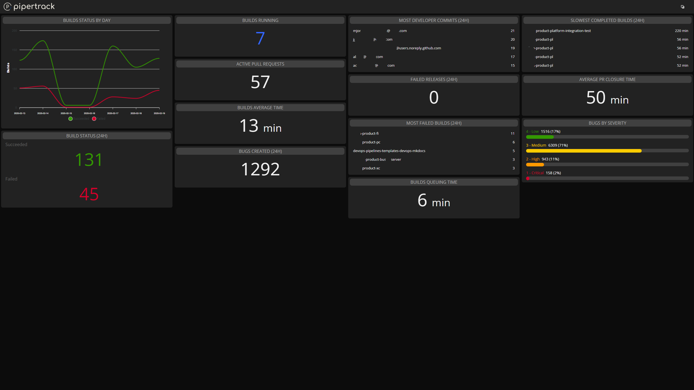

# Pipertrack - Azure DevOps Dashboard


This application provides a real-time dashboard that connects to Azure DevOps to monitor key metrics such as:

- Number of successful and failed builds in the last 24 hours
- Current running builds
- Bugs created in the last 24 hours
- Bugs by severity



## Prerequisites

Before running the application, you must configure the `config.json` file with the following information:

### Example `config.json` File

```json
{
    "azureDevOpsUrl": "https://dev.azure.com/your-organization",
    "personalAccessToken": "your pat",
    "teamProjects": [
        "Team Project A",
        "Team Project B"
    ]
}
```

## Getting the Application

You can get the application by either cloning the repository or downloading the ZIP file from the "Releases" tab.
