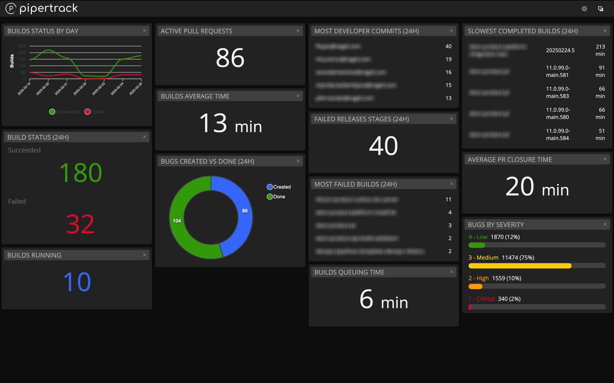

# Pipertrack - Live Dashboard for Azure DevOps Metrics

Pipertrack is an intuitive application that provides a live dashboard for tracking key metrics in your Azure DevOps environment. With this tool, you can get real-time insights into your DevOps workflow and make informed decisions based on up-to-date information.

## Features

- **Builds Running**  
  View the current status of running builds.

- **Successful and Failed Builds (Last 7 Days)**  
  A graph that displays the count of successful and failed builds over the past 7 days.

- **Bugs Created vs Done(Last 24 Hours)**  
  A snapshot of bugs created vs Done within the last 24 hours.

- **Longest Running Builds**  
  Track the builds that took the longest time to complete.

- **Most Commits by User (Last 24 Hours)**  
  See which users made the most commits in the last 24 hours.

- **Active Pull Requests**  
  Monitor the active pull requests in your projects.

- **Builds that Failed the Most (Last 24 Hours)**  
  Get a list of builds that failed most frequently in the last 24 hours.

- **Bugs by Severity**  
  View the distribution of bugs categorized by their severity level.

- **And More...**  
  Explore additional features as we continue to improve the tool!

## How to Use

1. **Azure DevOps URL**: Simply input your Azure DevOps instance URL along with the organization name.
2. **Personal Access Token (PAT)**: Provide your PAT for secure access to your Azure DevOps data.
3. **Team Projects**: Choose the Team Projects from which you'd like to collect live metrics and start tracking.

## Getting the Application

You can get the application by either cloning the repository or downloading the ZIP file from the "Releases" tab.

## Contributing

We welcome any contributions to improve Pipertrack! Whether it's bug fixes, new features, or improvements, your help is always appreciated.

---

Feel free to reach out if you have any questions or suggestions. Happy tracking!

